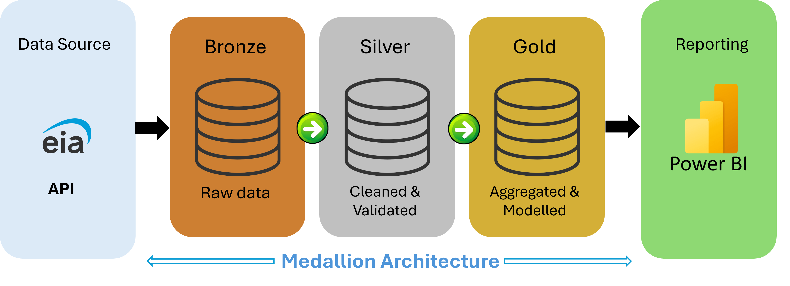
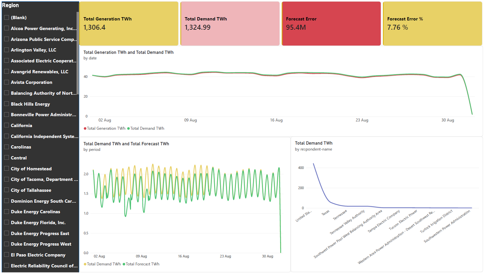

# Fabric-Energy-Data-pipeline-PowerBI
End-to-end data engineering pipeline using EIA electricity data, Microsoft Fabric, PySpark, Delta Lake, Medallion Architecture, and Power BI.

## Architecture

The project follows a Medallion Architecture in Microsoft Fabric, transforming EIA electricity data through Bronze, Silver, and Gold layers before reporting in Power BI.

## Power BI Dashboard

The Gold-layer dimensional model is used by Power BI for electricity demand, generation, forecasting, and regional analysis.

